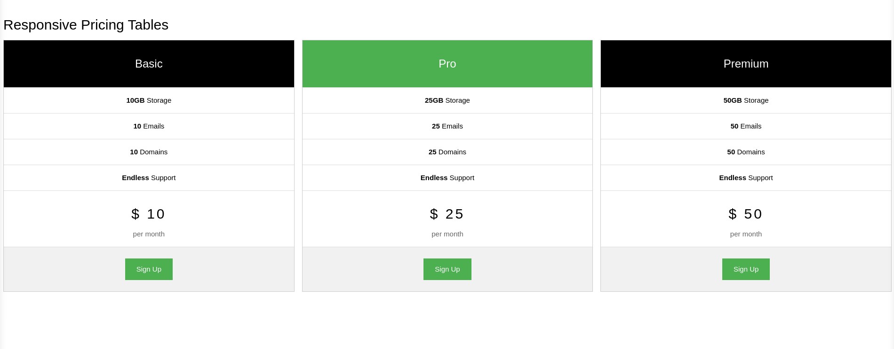

### Exercício 1 - HTML e CSS
Neste exercício, você deve replicar a tela mostrada na imagem a seguir: 

#### Dicas 
1. Você provavelmente já identificou que precisará de alguns containers para reproduzir essa imagem; 
2. Utilize tags semânticas para praticar;
3. No seu CSS, terá que trabalhar com posicionamento desses containers para colocá-los um ao lado do outro; 
4. O código de cor do tom de verde da imagem é: #4CAF50, mas você pode usar as cores que quiser.
